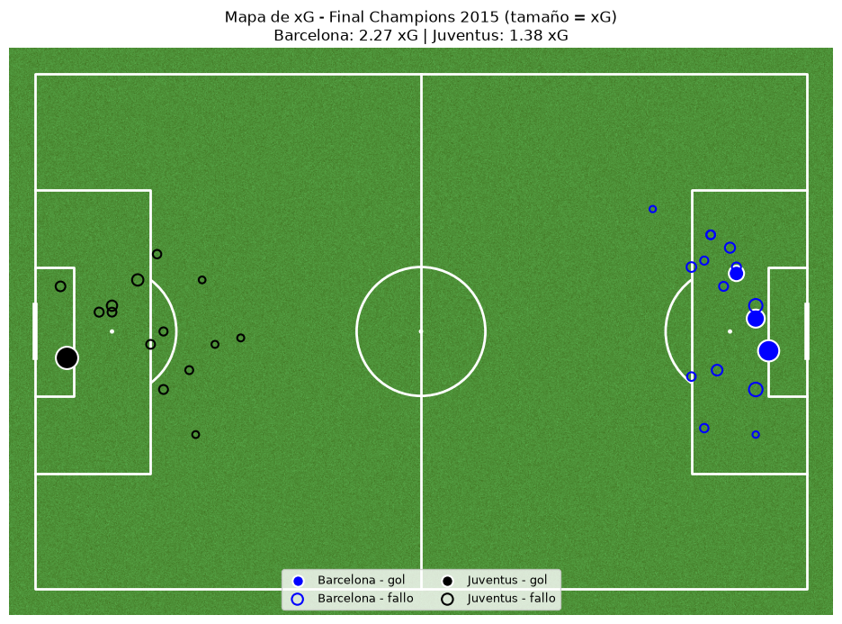

# Final de la Champions League 2015: análisis de xG

Análisis de la final de la Champions League 2014/15 (**Juventus 1 – 3 Barcelona**, Berlín, 6 de junio de 2015) con los datos abiertos de [StatsBomb](https://github.com/statsbomb/open-data).



## Preguntas

1. ¿Qué equipo generó más volumen ofensivo (tiros y goles)?
2. ¿Quién dominó el balón (pases, precisión de pase y posesión)?
3. ¿Desde dónde disparó cada equipo y con qué calidad de ocasión (xG)?

## Resultados principales

| Métrica | Barcelona | Juventus |
|---|---|---|
| Goles | 3 | 1 |
| Tiros | 17 | 15 |
| xG | 2,27 | 1,38 |
| Pases | 600 | 377 |
| Precisión de pase | 85,8 % | 78,2 % |
| Posesión (por nº de eventos)* | 60 % | 40 % |

- La diferencia entre los dos equipos está en la **calidad de las ocasiones** más que en el volumen de tiros: 16 de los 17 tiros del Barcelona salen del área.
- Aproximadamente la mitad de los tiros de la Juventus son desde fuera del área, con xG bajo. Su mejor ocasión, el gol de Morata (~0,60 xG), fue la de mayor xG del partido.
- El Barcelona controló el balón: dio más pases, con mejor precisión.

\* La posesión se aproxima por la proporción de eventos de cada equipo, no por el tiempo con balón. El notebook explica esta limitación.

## Tecnologías

- **Python**
- **statsbombpy:** acceso a los datos de StatsBomb
- **pandas:** cálculo de métricas
- **mplsoccer** y **matplotlib:** visualización en el campo

## Cómo ejecutarlo

```bash
git clone https://github.com/ikergisbertf14/UCL-final-2015-xg-analysis.git
cd UCL-final-2015-xg-analysis
python -m venv .venv
.venv\Scripts\activate        # Windows (en macOS/Linux: source .venv/bin/activate)
pip install -r requirements.txt
jupyter notebook analisis_xg_final_champions_2015.ipynb
```

## Estructura

```
├── analisis_xg_final_champions_2015.ipynb   # Notebook con el análisis completo
├── images/
│   └── mapa_xg.png     # Mapa de xG
├── requirements.txt    # Dependencias
├── LICENSE
└── README.md
```

## Datos

Datos de [StatsBomb Open Data](https://github.com/statsbomb/open-data), de uso libre con atribución a StatsBomb.

## Licencia

El código de este proyecto está bajo la licencia [MIT](LICENSE). Los datos siguen las condiciones de uso de StatsBomb.
